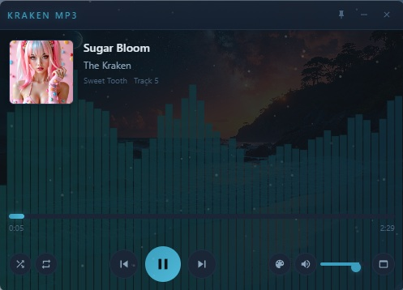
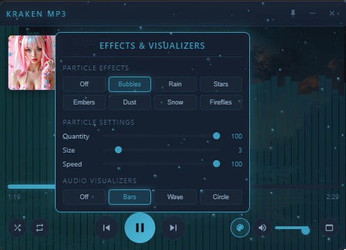
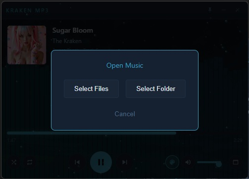

# Kraken MP3 Player

A compact, Winamp-style MP3 player with the Kraken Unbound aesthetic - featuring customizable particle effects, audio visualizers, and rotating background wallpapers.

## Screenshots





## Features

- **Compact Design**: Small footprint, resizable interface (500x360 default)
- **Kraken Theme**: Ocean-inspired dark theme with bioluminescent accents
- **Visual Effects** (press `~` to open effects menu):
  - 8 particle effects: Bubbles, Rain, Shooting Stars, Embers, Dust, Snow, Fireflies
  - Per-effect settings for quantity, size, and speed
  - Particle burst effects on track change
  - 3 audio visualizers: Bars, Waveform, Circle
  - 10-band graphic EQ with presets, preamp, and custom tuning
  - Rotating background wallpapers with smooth crossfade
  - Animated Kraken logo as default album art
- **Audio Support**: MP3, FLAC, WAV, OGG, M4A, AAC, WMA, OPUS
- **Metadata Display**: Title, Artist, Album, Track Number
- **Scrolling Comment**: MP3 comment metadata scrolls across the display (like a news ticker)
- **Album Art**: Displays embedded album art from audio files
- **File Association**: Can be set as default player for audio files
- **Keyboard Shortcuts**:
  - `Space` - Play/Pause
  - `Left/Right` - Seek 5 seconds
  - `Ctrl+Left/Right` - Previous/Next track
  - `Up/Down` - Volume
  - `M` - Mute
  - `S` - Shuffle
  - `R` - Repeat mode
  - `Ctrl+O` - Open files
  - `~` - Toggle effects menu

## Installation

### Windows Installer

1. Download `Kraken MP3 Setup 1.0.1.exe` from the releases
2. Run the installer (you may need to click "More info" → "Run anyway" on Windows SmartScreen)
3. Choose installation directory and options
4. The installer will:
   - Install Kraken MP3 to your chosen location
   - Create desktop and Start Menu shortcuts
   - Register file associations for audio formats

**Note**: On first run, Windows SmartScreen may scan the unsigned executable. If it appears nothing happens on double-click, wait a moment and try again - this is a one-time scan.

### Portable Version

The `Kraken_MP3_Portable.exe` runs without installation. It extracts to a temp folder on each launch, so startup is slightly slower than the installed version.

### Development

1. Install Node.js (v18 or later recommended)
2. Navigate to the Kraken_MP3 folder
3. Install dependencies:
   ```bash
   npm install
   ```
4. Run in development mode:
   ```bash
   npm start
   ```

### Building from Source

1. Ensure you have the icon files ready:
   - `assets/icons/icon.png` (256x256)
   - `assets/icons/icon.ico` (multi-size ICO file)

2. Build the executable:
   ```bash
   npm run build:win
   ```

3. Output files in the `dist` folder:
   - `Kraken MP3 Setup 1.0.1.exe` - Windows installer
   - `Kraken_MP3_Portable.exe` - Portable single-file executable
   - `win-unpacked/` - Unpacked application folder

## File Association

After installing via the NSIS installer, the app will automatically register itself for:
- `.mp3`
- `.flac`
- `.wav`
- `.ogg`
- `.m4a`
- `.aac`

You can set Kraken MP3 as your default player in Windows Settings > Apps > Default Apps.

## Adding Custom Backgrounds

Place 16:9 aspect ratio images (PNG, JPG, or WebP) in:
- Development: `assets/backgrounds/`
- Production: The backgrounds folder in your app installation directory

## Customization

The player saves your preferences including:
- Volume level
- Shuffle/Repeat modes
- Particle effects enabled/disabled

Settings are stored in localStorage and persist between sessions.

## Tech Stack

- **Electron**: Cross-platform desktop framework
- **music-metadata**: ID3 tag parsing for audio metadata
- **electron-builder**: For creating Windows installers

## Theme Colors

Based on the Kraken Unbound website theme:

```css
--bg-primary: #0f1115
--bg-secondary: #152030
--accent: #3b9ebe
--accent-hover: #4fb8d8
--text-primary: #e0e8f0
--text-secondary: #8aa4bc
```

## License

MIT License - Kraken Unbound
