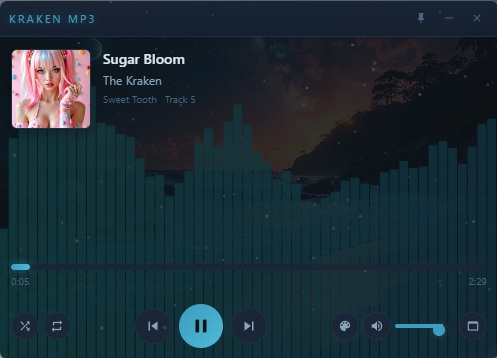
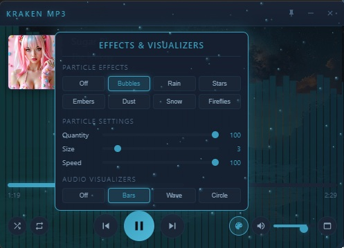
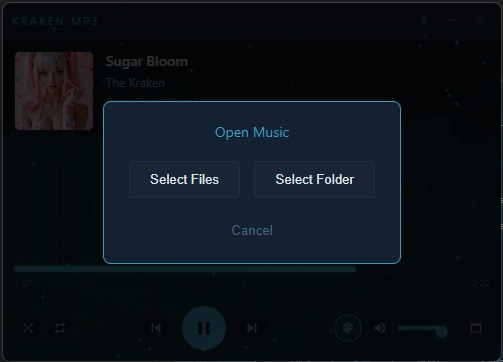

# Kraken MP3 Player (legacy UI)

> **Released app (Winamp Edition):** [kraken-mp3-winamp](https://github.com/krakenunbound/kraken-mp3-winamp) — installers in **`Install File`**, full **[USER_GUIDE](https://github.com/krakenunbound/kraken-mp3-winamp/blob/master/USER_GUIDE.md)** on that repo.

This folder is an older compact UI variant. The table below still applies to playback in both trees.

A compact MP3 player with the Kraken Unbound aesthetic — particle effects, audio visualizers, and rotating background wallpapers.

## Screenshots





## Features

- **Compact Design**: Small footprint, resizable interface (500x360 default)
- **Kraken Theme**: Ocean-inspired dark theme with bioluminescent accents
- **Visual Effects** (press `~` to open effects menu):
  - 8 particle effects: Bubbles, Rain, Shooting Stars, Embers, Dust, Snow, Fireflies
  - Per-effect settings for quantity, size, and speed
  - Particle burst effects on track change
  - **Audio Visualizers**: 3 modes (Bars, Waveform, Circle)
  - **10-band Graphic EQ**: Presets (Rock, Pop, etc.), Preamp control, and custom tuning
  - Rotating background wallpapers with smooth crossfade
  - Animated Kraken logo as default album art
- **Audio support**: MP3, FLAC, WAV, OGG, M4A, AAC, WMA, OPUS (open/add in app; WMA/Opus may not get installer file associations on the Winamp release)
- **Metadata Display**: Title, Artist, Album, Track Number
- **Scrolling Comment**: MP3 comment metadata scrolls across the display (like a news ticker)
- **Album Art**: Displays embedded album art from audio files
- **File Association**: Can be set as default player for audio files
- **Keyboard Shortcuts**:
  - `Space` - Play/Pause
  - `Left/Right` - Seek 5 seconds
  - `Ctrl+Left/Right` - Previous/Next track
  - `Up/Down` - Volume
  - `M` - Mute
  - `S` - Shuffle
  - `R` - Repeat mode
  - `Ctrl+O` - Open files
  - `~` - Toggle effects menu

## Installation

Use the **`Install File`** folder (or [Winamp Edition releases](https://github.com/krakenunbound/kraken-mp3-winamp/releases/latest)):

1. Run **`Kraken MP3 Setup 1.0.0.exe`** for a normal install, or **`Kraken MP3 1.0.0.exe`** for portable.
2. On SmartScreen, choose **More info** → **Run anyway** if needed (unsigned build).
3. Optional: enable file associations for MP3, FLAC, WAV, OGG, M4A, AAC during setup.

### Development

1. Install Node.js (v18 or later recommended)
2. Navigate to the Kraken_MP3 folder
3. Install dependencies:
   ```bash
   npm install
   ```
4. Run in development mode:
   ```bash
   npm start
   ```

### Building from Source

1. Ensure you have the icon files ready:
   - `assets/icons/icon.png` (256x256)
   - `assets/icons/icon.ico` (multi-size ICO file)

2. Build the executable:
   ```bash
   npm run build:win
   ```

3. Output in `dist/`; copy installers to **`Install File`** for easy access (see [kraken-mp3-winamp](https://github.com/krakenunbound/kraken-mp3-winamp) for the maintained Winamp build).

## File Association

After installing via the NSIS installer, the app will automatically register itself for:
- `.mp3`
- `.flac`
- `.wav`
- `.ogg`
- `.m4a`
- `.aac`

You can set Kraken MP3 as your default player in Windows Settings > Apps > Default Apps.

## Adding Custom Backgrounds

Place 16:9 aspect ratio images (PNG, JPG, or WebP) in:
- Development: `assets/backgrounds/`
- Production: The backgrounds folder in your app installation directory

## Customization

The player saves your preferences including:
- Volume level
- Shuffle/Repeat modes
- Particle effects enabled/disabled

Settings are stored in localStorage and persist between sessions.

## Tech Stack

- **Electron**: Cross-platform desktop framework
- **music-metadata**: ID3 tag parsing for audio metadata
- **electron-builder**: For creating Windows installers

## Theme Colors

Based on the Kraken Unbound website theme:

```css
--bg-primary: #0f1115
--bg-secondary: #152030
--accent: #3b9ebe
--accent-hover: #4fb8d8
--text-primary: #e0e8f0
--text-secondary: #8aa4bc
```

## Credits

**The Kraken** (Kraken Unbound) — creator. Shipped Winamp Edition: [kraken-mp3-winamp](https://github.com/krakenunbound/kraken-mp3-winamp).

## License

MIT — Copyright © 2026 The Kraken (Kraken Unbound)
